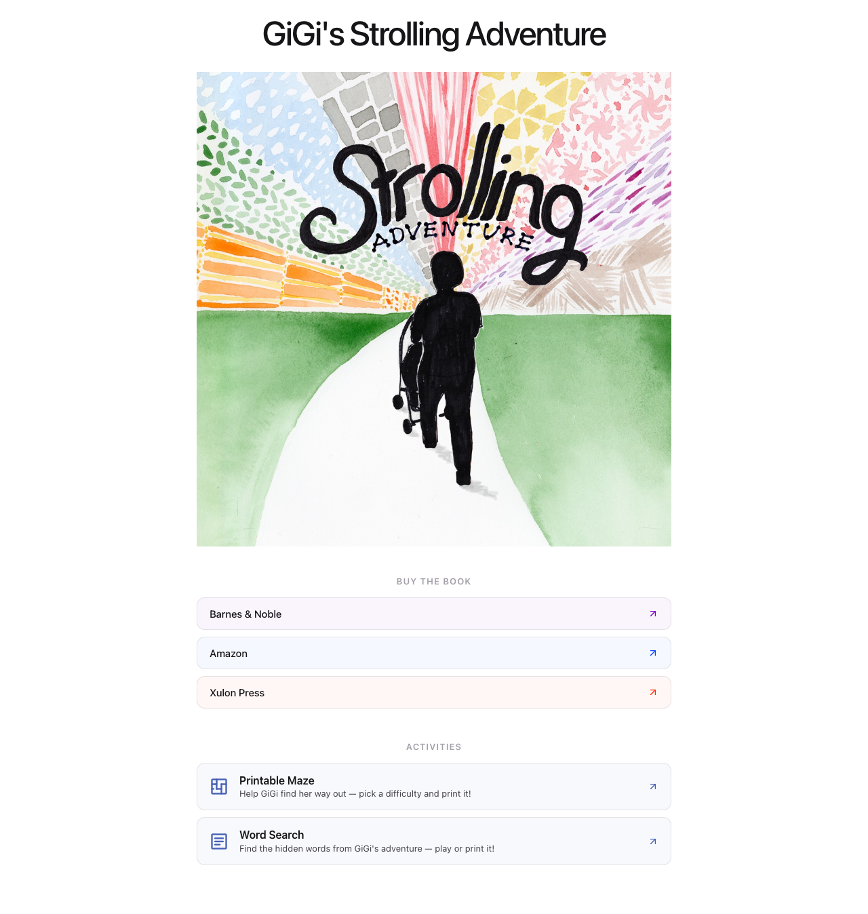

# QA Test Case: Home Page Cover Image

| Field | Value |
|-------|-------|
| **Test case ID** | TC-HOME-001 |
| **Feature** | Home page cover image replacement |
| **Enhancement doc** | [home-cover-image.md](../enhancements/home-cover-image.md) |
| **Environment** | Local (`npm start`) or production hosting |
| **Date created** | June 10, 2026 |

## Objective

Confirm the home page displays the Strolling Adventure book cover illustration instead of the former sunset image, with correct accessibility text, layout, and asset availability.

## Prerequisites

- Repository checked out with this enhancement applied
- Dependencies installed: `npm install`
- Dev server running: `npm start` (local) **or** latest build deployed (production)

## Test data

| Asset | Expected URL path |
|-------|-------------------|
| New image | `/cover-spread.png` |
| Removed image | `/sun-color-2020-09-26.jpg` (must not exist) |

## Test cases

### TC-HOME-001-01 — Cover image displays on home page

| Step | Action | Expected result |
|------|--------|-----------------|
| 1 | Open `/` (home route) | Page loads without console errors |
| 2 | Locate the feature image below "GiGi's Strolling Adventure" | Book cover illustration is visible (stroller silhouette, "Strolling ADVENTURE" artwork) |
| 3 | Confirm the sunset photograph is **not** shown | Old sunset image does not appear |

**Pass criteria:** New cover art is visible; old sunset image is absent.

---

### TC-HOME-001-02 — Image source and accessibility

| Step | Action | Expected result |
|------|--------|-----------------|
| 1 | Inspect the feature `` element | `src` resolves to `cover-spread.png` |
| 2 | Check `alt` attribute | Value is `Strolling Adventure book cover illustration` |
| 3 | Check CSS class | Element has class `feature-image` |

**Pass criteria:** Correct `src`, `alt`, and class on the home page image.

---

### TC-HOME-001-03 — Static asset HTTP status

| Step | Action | Expected result |
|------|--------|-----------------|
| 1 | Request `GET /cover-spread.png` | HTTP 200; PNG image returned |
| 2 | Request `GET /sun-color-2020-09-26.jpg` | HTTP 404 (file removed) |

**Pass criteria:** New asset served; legacy asset unavailable.

---

### TC-HOME-001-04 — Responsive layout

| Step | Action | Expected result |
|------|--------|-----------------|
| 1 | View home page at desktop width (~1280px) | Image spans content width; aspect ratio preserved; no horizontal scroll |
| 2 | Resize to mobile width (~375px) | Image scales down; remains fully visible; no clipping or overflow |
| 3 | Confirm sections below image | "Buy the Book" and "Activities" sections remain readable and unchanged |

**Pass criteria:** Image is responsive; page layout below image is unaffected.

---

### TC-HOME-001-05 — Regression: home page sections

| Step | Action | Expected result |
|------|--------|-----------------|
| 1 | Verify page title | "GiGi's Strolling Adventure" displays |
| 2 | Click each retailer link (Barnes & Noble, Amazon, Xulon Press) | Links open correct external URLs in a new tab |
| 3 | Click "Printable Maze" activity card | Navigates to `/maze` |
| 4 | Click "Word Search" activity card | Navigates to `/wordsearch` |

**Pass criteria:** Only the feature image changed; other home page behavior is intact.

## Visual reference

## Sign-off

| Role | Name | Date | Result |
|------|------|------|--------|
| Tester | | | Pass / Fail |
| Reviewer | | | Approved / Rejected |

## Defect log

| ID | Summary | Severity | Status |
|----|---------|----------|--------|
| | | | |
